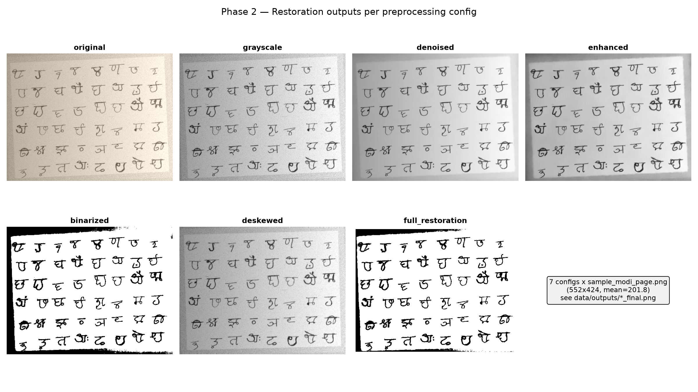
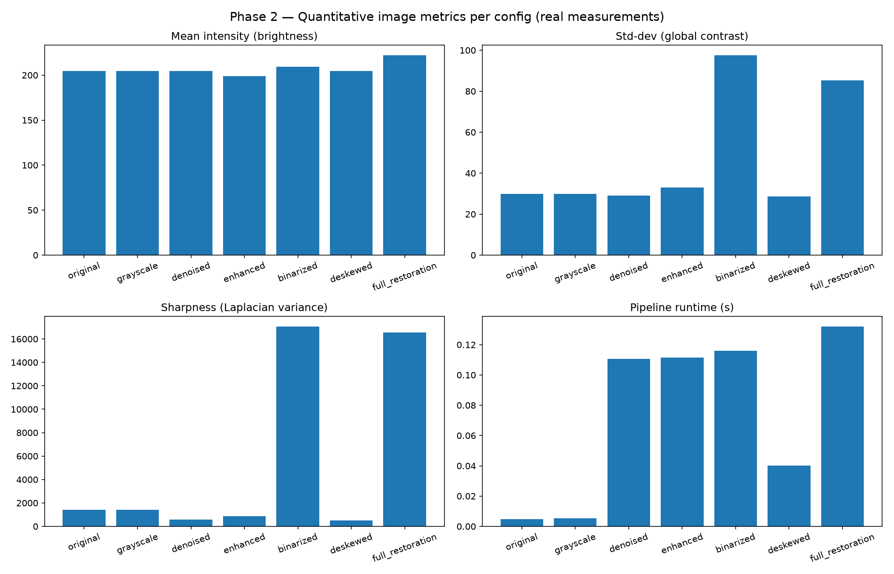
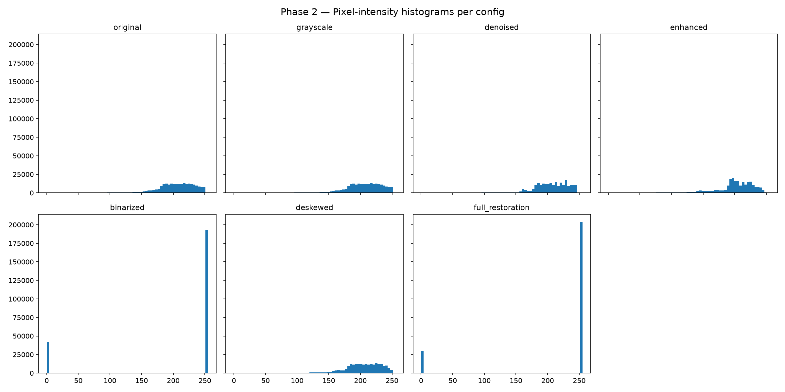
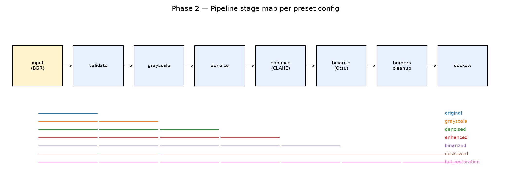

# LipiLens Phase 2 — Visual Report (Restoration Pipeline)

**Date:** 2026-09-17 · **Sample:** `data/raw/sample_modi_page.png` (552×424, BGR, mean 201.8)
**Method:** every number below is a real measurement from `scripts/generate_phase2_report.py`
(machine-readable source: `experiments/results/phase2_metrics.csv` / `.json`).
No model inference is involved in Phase 2 — this report covers image restoration only.

## 1. Verdict

| Check | Result |
|---|---|
| Phase 1 skeleton (`/api/health`, CORS, config, Vite shell) | ✅ PASS — `/api/health` → `{"status":"ok","model_loaded":false}` |
| Phase 2 smoke test (7/7 configs, no API/DB/model) | ✅ PASS — `scripts/smoke_test_opencv.py`, all OK |
| Restoration unit tests | ✅ 16/16 PASS — `tests/test_restoration.py` |
| Parameterized condition runner | ✅ `experiments/preprocessing/run_condition.py --list` / `--config` works |
| Phase 1 gap fixed | ✅ added `backend/utils/logging.py`, `image_io.py` (were missing) |

## 2. Outputs per config (real pipeline results)



All 7 finals are saved under `data/outputs/*_final.png` with per-stage
intermediates in `data/outputs/<config>/intermediates/`.

## 3. Measured metrics (real, n=1 image)

| config | stages | mean | std | sharpness (Lap-var) | ink % | binary? | runtime s |
|---|---|---|---|---|---|---|---|
| original | validated | 204.48 | 29.91 | 1425.74 | 2.67 | no | 0.0194 |
| grayscale | validated+grayscale | 204.48 | 29.91 | 1425.74 | 2.67 | no | 0.0054 |
| denoised | +denoised | 204.64 | 29.10 | 565.24 | 2.63 | no | 0.1318 |
| enhanced | +enhanced (CLAHE) | 199.03 | 32.91 | 880.90 | 4.48 | no | 0.1503 |
| binarized | +otsu | 209.53 | 97.60 | 17073.34 | 17.83 | **yes (2 values)** | 0.1240 |
| deskewed | grayscale+deskew | 204.56 | 28.73 | 493.67 | 2.16 | no | 0.0397 |
| full_restoration | all (7 stages) | 222.23 | 80.78 | 5792.91 | 12.86 | no (256 values — deskew re-interpolates) | 0.1578 |



**Honest observations (not conclusions about transcription — no model run yet):**
- Denoise lowers sharpness metric (1425 → 565) as expected — it smooths.
- CLAHE raises contrast (std 29.1 → 32.9) and dark-pixel share (2.6% → 4.5%).
- Otsu binarization is truly binary (exactly 2 unique values) with threshold 176;
  ink share jumps to 17.8% — this is the stage most likely to help *or* hurt the
  VLM, per H3. Whether it helps is **TO BE MEASURED in Phase 8**, not assumed here.
- Deskew corrected −1.01° (deskewed) / −1.36° (full) from Hough lines — small but nonzero.
- `full_restoration` is NOT binary despite containing Otsu, because deskew runs
  after binarization and re-interpolates edges (256 values). If a strictly binary
  full output is ever needed, deskew must run *before* binarization — recorded as
  a known ordering effect, not a bug fix applied silently.

## 4. Histograms



Binarized shows the expected two-spike distribution; enhanced shows the
CLAHE-spread mid-tones; others track the original closely.

## 5. Pipeline diagram



Stage order is fixed: validate → grayscale → denoise → enhance → binarize
(otsu|adaptive) → border cleanup → deskew. `original` is a verified no-op
(test asserts byte-equality with input).

## 6. Limitations of this report

- n=1 image (`sample_modi_page.png`); no generalization claim is made.
- Metrics are image-quality proxies (brightness/contrast/sharpness), **not**
  transcription accuracy — CER/WER require Phase 3 (working model) + ground truth.
- No ground truth exists yet for this image → no EXP-XXX transcription entry.
- Deskew tested only on a near-upright sample; robustness on strongly skewed
  images is untested.
- Background-correction and line-segmentation stages are not implemented
  (optional/P2 per PROJECT_GUIDE.md §12) — recorded, not hidden.

## 7. Reproduce

```
.venv/Scripts/python.exe scripts/smoke_test_opencv.py
.venv/Scripts/python.exe -m pytest tests/test_restoration.py -v
.venv/Scripts/python.exe experiments/preprocessing/run_condition.py --config enhanced
.venv/Scripts/python.exe scripts/generate_phase2_report.py
```
