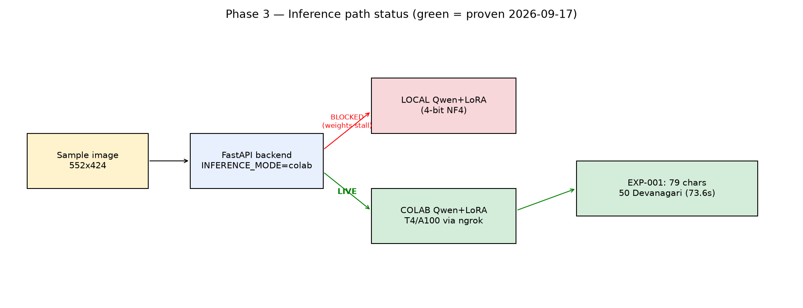
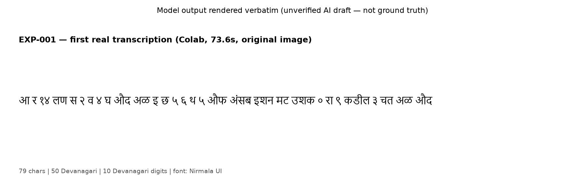
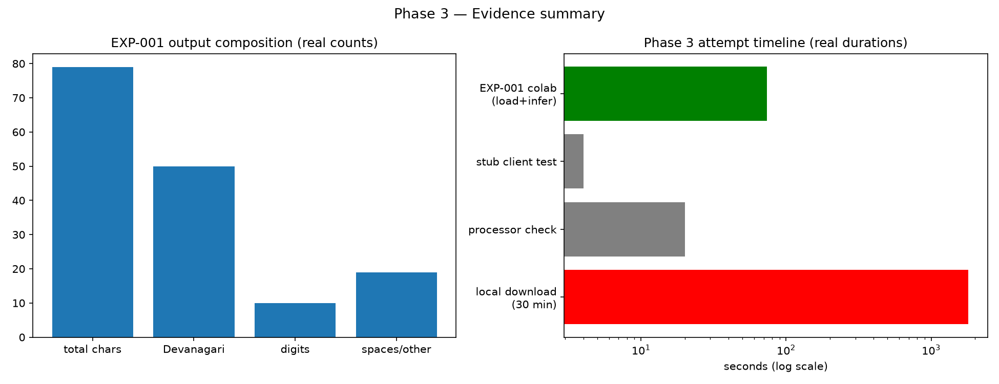

# LipiLens Phase 3 — Visual Report (Model Smoke Test)

**Date:** 2026-09-17 · **Result: PASS via Colab** (local path blocked, documented below)
**Evidence file:** `experiments/results/EXP-001_transcription.json` (raw model text),
`experiments/results/exp_log.csv` (EXP-001 row), `data/outputs/first_transcription.txt`.

## 1. Verdict

| Check | Result |
|---|---|
| Colab endpoint reachable (`/health` 200) | ✅ |
| First real inference, non-empty Devanagari output | ✅ EXP-001, 73.6 s (incl. Colab cold-start/model load) |
| Output sanity (Devanagari, no prompt echo, no loop) | ✅ 79 chars, 50 Devanagari, single line, ends cleanly |
| Local weight download | ❌ stalled (see `PHASE3_BLOCKER.md`, unchanged) — Colab is primary path |
| Fixes applied this phase | ✅ Colab client timeout (900 s), smoke-test honors `INFERENCE_MODE`, safe console printing |

## 2. Inference path status



## 3. The transcription (verbatim AI draft, NOT verified)



Input context: the sample is a **handwritten Modi character chart (6×8 = 48
isolated glyphs)**, not a continuous manuscript page. The character-spaced
output shape is consistent with that input. 10 Devanagari digits appear among
the output — without ground truth these are recorded as *look-alike
substitutions to investigate*, not confirmed errors.

## 4. Evidence summary



## 5. Limitations (Phase 3 scope)
- n=1 image, and that image is a character chart — off-distribution for an
  adapter trained on document pages. A real manuscript page test is still needed.
- No ground truth → no CER/WER; EXP-001 is qualitative-only.
- 73.6 s includes one-time Colab model load; steady-state latency unknown.
- Colab GPU type, VRAM peak, and adapter revision are unrecorded (server exposes
  only `/health`; consider adding a `/gpu` endpoint — see suggestions).
- Colab sessions are ephemeral: this result is reproducible only while the
  notebook + tunnel are alive; the saved JSON is the permanent record.

## 6. Reproduce (while Colab session is warm)
```
.venv\Scripts\python.exe scripts\smoke_test_model.py
.venv\Scripts\python.exe -m pytest tests\test_colab_client.py -q
.venv\Scripts\python.exe scripts\generate_phase3_report.py
```
