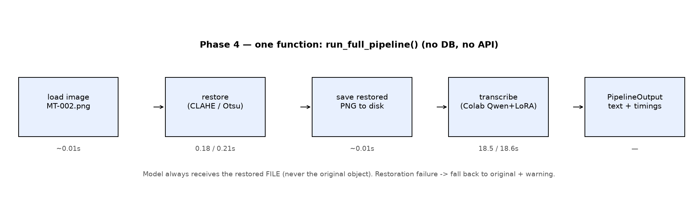
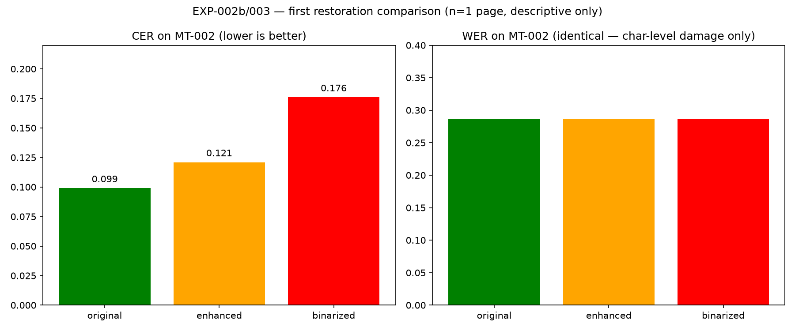

# LipiLens Phase 4 — Visual Report (Backend Integration)

**Date:** 2026-09-17 · **Result: PASS** — `run_full_pipeline()` ran 3× end-to-end
(enhanced, binarized, enhanced re-run) on MT-002 via Colab with zero wiring faults.
MVP note: one function, no DB, no API — persistence and routes are Phases 5/6.

## 1. The integrated pipeline



New files: `backend/services/pipeline.py` (`run_full_pipeline` + `PipelineOutput`),
`scripts/run_pipeline.py` (CLI, auto-saves restored PNG + hyp text),
`tests/test_pipeline.py` (3 offline stub tests — restored-file routing, fallback, bad config).

## 2. Validation runs (real, MT-002, Colab warm)

| run | config | restore | transcribe | CER | WER | exp |
|---|---|---|---|---|---|---|
| 1 | enhanced | 0.17 s | 19.1 s | — (hyp not saved; re-ran) | — | — |
| 2 | binarized | 0.21 s | 18.6 s | 0.176 | 0.286 | EXP-003b |
| 3 | enhanced (re-run) | 0.18 s | 18.5 s | 0.121 | 0.286 | EXP-003a |

Restoration costs ~0.2 s (CPU); transcription ~19 s dominates — pipeline latency
is model-bound, as expected.

## 3. First restoration effect (n=1 page — descriptive only)



original 0.099 → enhanced 0.121 → binarized 0.176 (WER flat at 0.286):
on this clean ruled sample, more processing hurts slightly at character level
and changes nothing at word level. Consistent with hypothesis H3; proves nothing
with n=1, but it is the first real data point for the core research question.

## 4. Limitations
- Single page (MT-002, clean handwriting) — degraded/difficult pages may behave oppositely.
- Run-1 hyp lost to a missing save (fixed: CLI now always writes `<stem>_<config>_hyp.txt`).
- No DB/API yet — outputs live in `data/processed/_pipeline/` and `experiments/results/`.

## 5. Reproduce
```
.venv\Scripts\python.exe scripts\run_pipeline.py --image data\raw\mode_trans\MT-002.png --config enhanced
.venv\Scripts\python.exe -m pytest tests\test_pipeline.py -q
.venv\Scripts\python.exe scripts\generate_phase4_report.py
```
