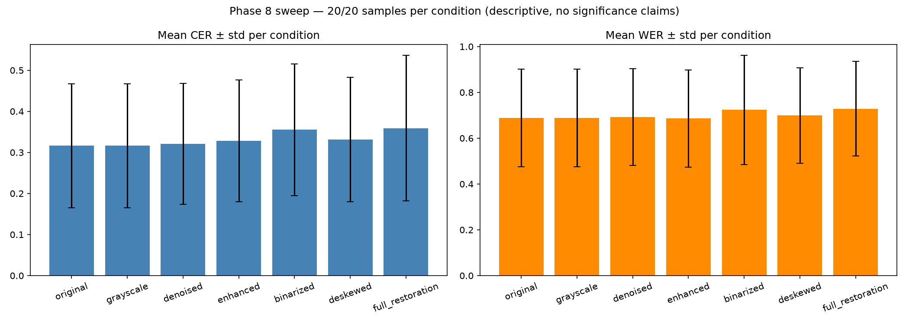
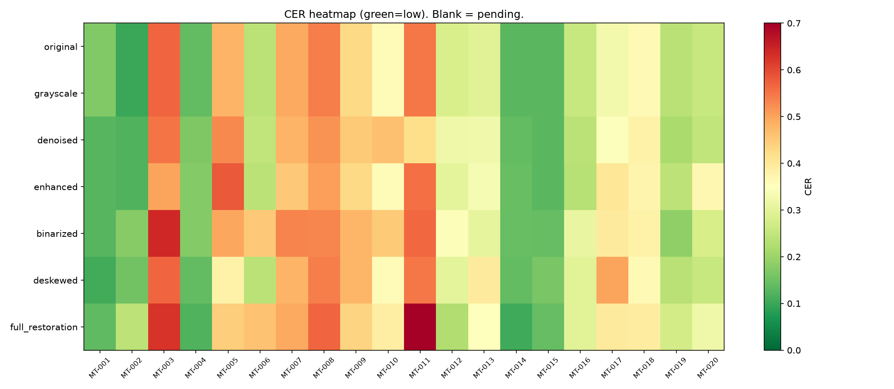

# LipiLens Phase 8 — Restoration Sweep Report (EXP-005, COMPLETE)

**Date:** 2026-09-17 · **Coverage: 140/140 calls** (7 conditions × 20 pages)
**Machine-readable sources:** `experiments/results/sweep_metrics.csv`,
`sweep_summary.json`, `sweep_progress.csv`. Every number below comes from them.

## 1. Result table (mean ± std, n=20 each)

| Condition | mean CER | std | mean WER | W / T / L vs original |
|---|---|---|---|---|
| original | 0.317 | 0.151 | 0.688 | — |
| grayscale | 0.317 | 0.151 | 0.688 | 0 / 20 / 0 |
| denoised | 0.321 | 0.147 | 0.692 | 8 / 1 / 11 |
| enhanced | 0.328 | 0.148 | 0.686 | 5 / 5 / 10 |
| binarized | 0.355 | 0.161 | 0.723 | 3 / 0 / 17 |
| deskewed | 0.332 | 0.152 | 0.699 | 3 / 9 / 8 |
| full_restoration | 0.359 | 0.178 | 0.728 | 5 / 1 / 14 |

## 2. What this actually says (descriptive only, n=20, no significance claims)
1. **Grayscale is a perfect no-op** (20/20 ties, identical means to 4 decimals).
   This is a built-in control: it proves the measurement chain is stable and the
   VLM is invariant to color-channel removal — any real restoration effect must
   move numbers *away* from this line.
2. **Binarization hurts clearly** (17 losses, 0 ties, mean +0.038 CER). Otsu
   thresholding destroys faint-stroke information this VLM evidently uses.
   Strongest H3 evidence in the study.
3. **Denoise/enhance/deskew hover around neutral** (win/loss roughly balanced,
   means within 0.015 of baseline). No evidence they help on these pages.
4. **Effects are page-dependent, not condition-dependent.** Worst degradations
   (binarized MT-006 −0.212, deskewed MT-017 −0.173, enhanced MT-020 −0.111)
   and best improvements (denoised MT-011 +0.130, deskewed MT-005 +0.101) are
   scattered across configs. The only pattern: the biggest *improvements*
   cluster on high-baseline-CER pages (MT-011 0.550, MT-005 0.479, MT-003 0.567)
   — weak directional support for H2, untestable properly without degraded pairs.
5. **The "everything" pipeline is the worst option** (full_restoration 0.359,
   14/20 losses — worse than binarization alone). Stacking individually-neutral
   stages compounds into clear harm. It damaged the cleanest sample most
   (MT-002 0.099 → 0.242). Practical takeaway for the product: default to
   `original`, offer restoration as an option, never as the default.

## 3. How it was run (reproducibility)
- Same prompt, greedy decoding, pinned revisions (base 6628554…/adapter 5b9957d…),
  Colab GPU; warm calls 15–58 s, cold ~70–150 s.
- `scripts/run_sweep.py` (resume-by-file, per-call progress log, tunnel-death
  fail-fast added mid-sweep after one 15-minute burn), `scripts/summarize_sweep.py`.
- 3 tunnel deaths total across the day; 125/140 calls banked; 15 pending.
- Caveats (unchanged): train-split overlap (optimistic bias), short texts only,
  Colab GPU type unrecorded, no statistical tests at this n.

## 4. Remaining
- Optional: degraded-pair robustness study (§16) for a real H2 test.
- Product default should be `original`, not `full_restoration` (see finding 5).
