# Showcase — 50 real Modi pages with proof of true transcription

Each row: the **original manuscript image**, the **expert Devanagari
reading** shipped with the dataset (ground truth — not ours), and **our
model's output** with its measured CER. Judges can verify by reading the
image against the expert text, then seeing how close the model came.

Source: `historyHulk/MoDeTrans` (IIT Roorkee, MIT license, paper arXiv
2503.13060). Model: Qwen2.5-VL-3B + `lgtk/qwen25vl-3b-modi-synth-lora`
via Colab GPU, official prompt, greedy decoding. CER = character error
rate vs the expert reading (0 = perfect).

## MT-001 (source `1.jpg`, CER 0.171)

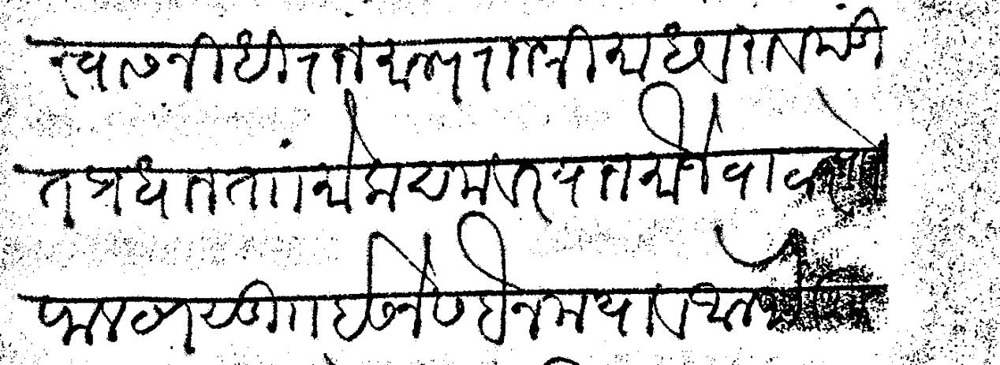

**Expert reading (111 chars):** स्वासनिधी राजमान्य राजश्री माधवराव पंडित प्रधान तां मोकदम व रयान मौजे वाठार पाा फलटण सुा इसने सबैन मया व अलफ तु

**Model output (109 chars):** स्वासनिधी राजमान्य राजश्री माधवराव पंडित प्रधान ता मोकदम व र याजकडे वाटले फालटण सु इसने सबैन मया व अलफ तुम्ही

---

## MT-002 (source `10.jpg`, CER 0.099)

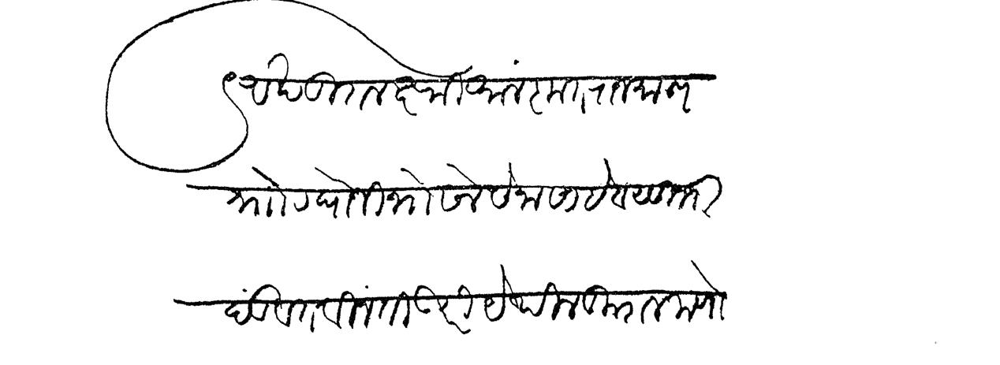

**Expert reading (91 chars):** अखंडित लक्ष्मी आलंकृत राजमान्य रघोजी भोसले सेनासाहेब सुभा दंडवत विनंती उपरी येथील कुशल जाणो

**Model output (95 chars):** अखंडित लक्ष्मी आलंकृत राजमान्य माो रघोजी भोसले सेनासाहेब सुभेर दंडवत विनंती उपरि येथील कुशल मणो

---

## MT-003 (source `1000.jpg`, CER 0.567)

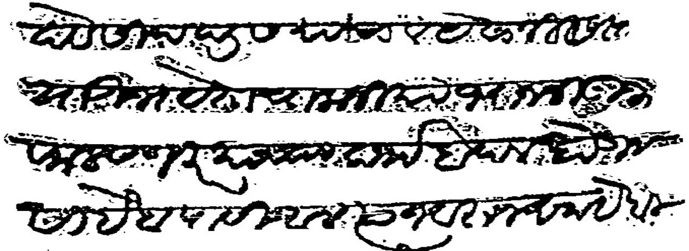

**Expert reading (120 chars):** देव सिद दडस याचा व येसाजी सिंदे या उभयताचा कजीया भानजी गुजर फलटणकर याच्या कर्जा बदल होऊन साहेबा पासी आले त्यावरून साहेबी

**Model output (129 chars):** देवसी पंपूर्व यांचा लिहे साजीस त्यांजर येता पाकनियावर भाजनी उजुफालवणीर याच्या वर्तमान धेणासी हे बापूसी आली त्याजवरून अन्हे बापूसी

---

## MT-004 (source `100.jpg`, CER 0.137)

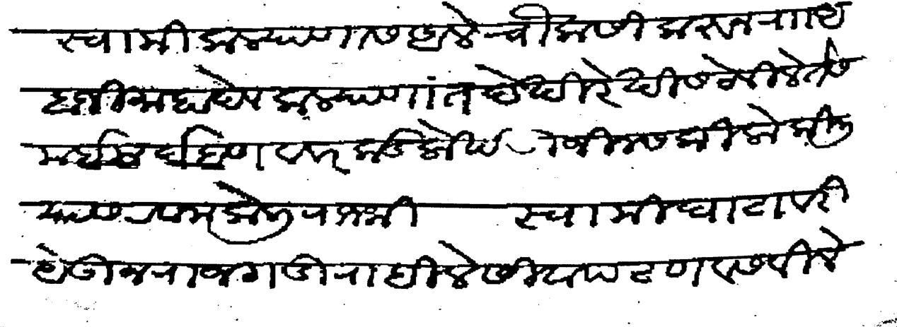

**Expert reading (190 chars):** स्वामी कल्याणास आले चौकसी करून राा आबाजी माहादेव कल्याणांत देखीरेखीस ठेविले ते समई मर्दबाण व वरकड लोखंडी जिनस किलो किलीयास रवाना केली राजश्री स्वामी घाटावरी येऊन राजगडी राहिले सीवापटण वसवीले

**Model output (189 chars):** स्वामी कल्याणास आले चौकसी करून राा अबाजी माहादेव कल्याणात देखीरे खिस ठेविले ते समई सदरहू व वरकड लोखंडी जिल्हेकी लोकी यास रवाना केली पाजश्ती स्वामी घाटावरी येऊन राजगडी राहिले सिवापठण व सविले

---

## MT-005 (source `1001.jpg`, CER 0.479)

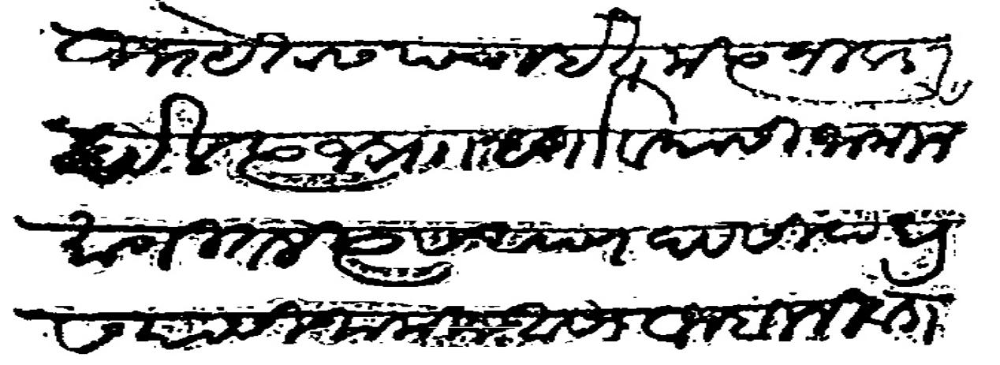

**Expert reading (119 chars):** उभयेतास पंचाईत मत्य निवाडा होईल त्याज प्राो वर्तावयासी जामीन मागीतले त्यास आपण देव सिद दडस यांसी जामीन असो वाजबी निवाडा

**Model output (105 chars):** तुम्ही रस पचाईत मया विलाज देल ५० जला धर्मावयासी भानकाजी तले त्यास आपण असियापूर्ण यासी जामीन आसा व बिनिवाग

---

## MT-006 (source `1002.jpg`, CER 0.239)

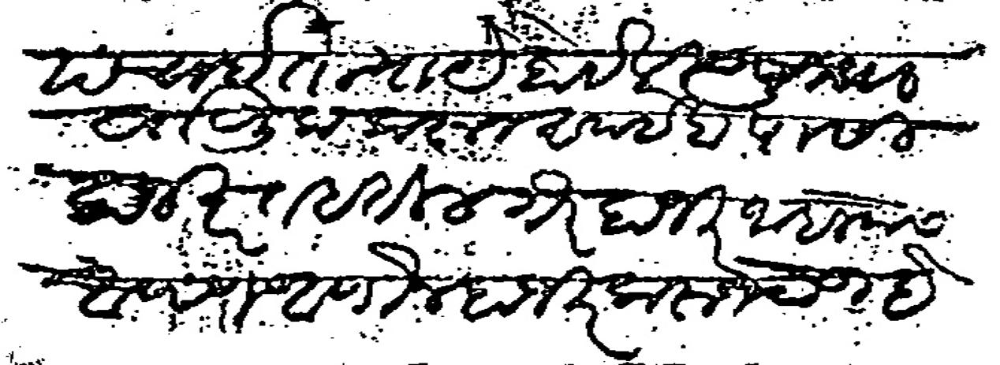

**Expert reading (113 chars):** पंचाईत न्याये होईल त्याच प्राा वर्तणुक करून साईबा पासी हाजीर राहतील गैर हाजिर जाहल्यास आपण आणून हाजिर करून देऊ हे

**Model output (109 chars):** पंचाईत न्याये होईल त्याप्रमाणे लिहून करून आपल्या पासीला खर तहतील गैर हाजर जाहल्यास आणणे आणौन हाजर करून देऊ हे

---

## MT-007 (source `1003.jpg`, CER 0.493)

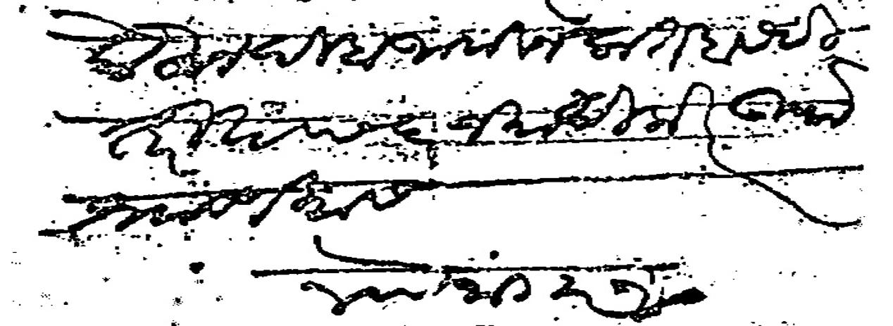

**Expert reading (73 chars):** लेहून दिल्हा जामीन कतबा सही तारिख ६ जमादीलखर ऊर्फ श्रावण मास निशाणी नांगर

**Model output (66 chars):** देऊन दिल्हा जाणोन लातब सही तरी खप ६ जमादिलाखर्चा वर्षास नोो भि रजब

---

## MT-008 (source `1004.jpg`, CER 0.539)

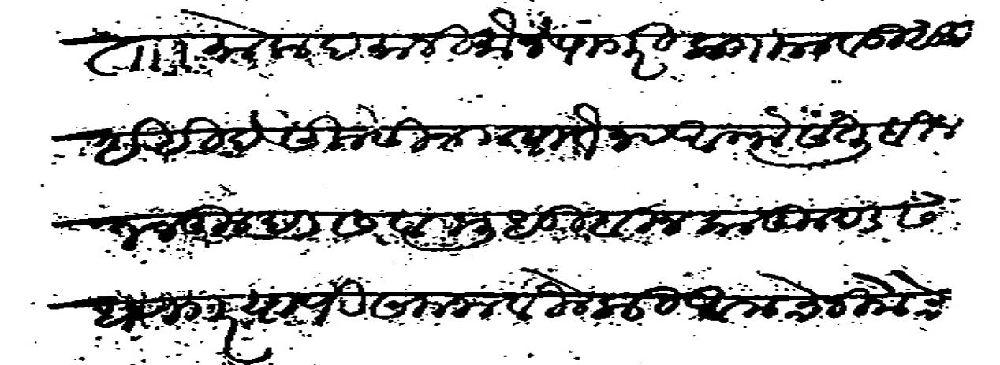

**Expert reading (141 chars):** तालुका मोकदमानी मौजे पांगरी कसबे मावड़ी सु ईहीदे सिलासीन मयातैन व अलफ संतू बीन जनकू दडस व मुधु बीन काकू दडस धणगर याणी समजावीले की आमचे नीमेचे

**Model output (133 chars):** ता १ मोकदमाने मौजे पांगरी लागला वडीलाही हे सुहूर म्हणोन आपले हंतुबिल जनार्दन दास बापू धुर्बान काकडीस आपल्या पायेसाना विलेली आमचे निमे

---

## MT-009 (source `1005.jpg`, CER 0.429)

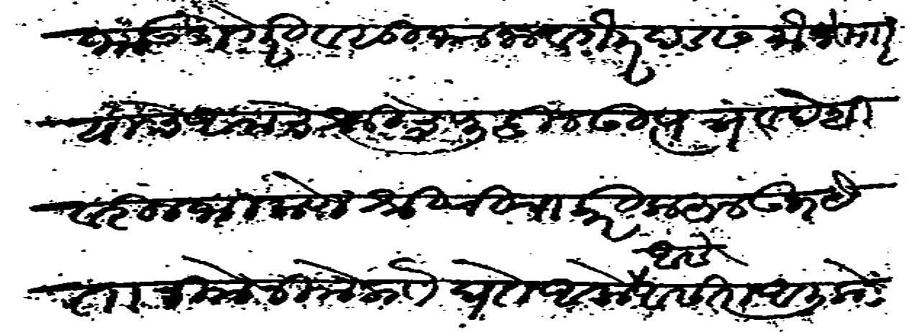

**Expert reading (147 chars):** भाऊ डोंगरी व सुभाना वगैरे दडस मौजे माार याचे आमचे श्री पुढील उत्पन्न देशावरील भिकणे श्रीची चाकरी करून उभयेतानी नीमनीम प्राो घेत आलो आसे आसता आलीकडे

**Model output (139 chars):** जाऊ दोगरी व सुभा नवगौर दडस मौजे मारवाली अमचे श्रीचे पुढील उपचारे व देही वर्कल भिकणे श्री खंडाकर तुम्ही येता जिल्हेची लोक घेत आलो आसता आम्ही

---

## MT-010 (source `1006.jpg`, CER 0.359)

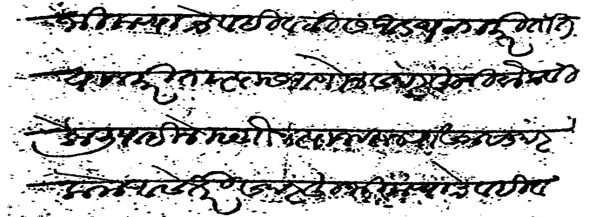

**Expert reading (142 chars):** भिकण्याचे वहिवाटीस आडथळा करितात याजकरिता त्यास आणोन सदरहूची चौकसी केली पाहिजे म्हणोन त्याजवरून रोखा सादर केला असे तरी सदरहू भिकण्याचे वहीवाटीस

**Model output (140 chars):** किकव्य चे वहीवाटीस आडथला करितात याजकरिता पत्र सदाणेस डाकेतून देणे कवि लाली पाहिजे म्हणोन स्वानुभव राखून परकमे असे तरी सपटचे भिकणाचे वहीवाटीस

---

## MT-011 (source `1007.jpg`, CER 0.550)

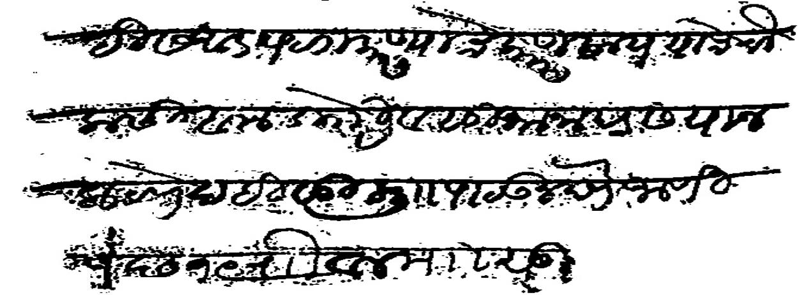

**Expert reading (131 chars):** वहीवाटीस अडथळा करण्याचे कारण काय याचे चौकसी बाबत डोगरी व सुभाना दडस याजला ठाणे दहीवाडी मुकामी पाठऊन देणे जाणीजे छ१९ रौवल मोर्तब सुद

**Model output (122 chars):** पाहिजे संवत्सर पदार्थ आणि चे देणे लाय या प्रो चौकसी बालडोरी व सुभा नाव सवान देवगृह इस्तली पाठऊन देणे जाणिजे छ १९ रोजमा सुद

---

## MT-012 (source `1008.jpg`, CER 0.280)

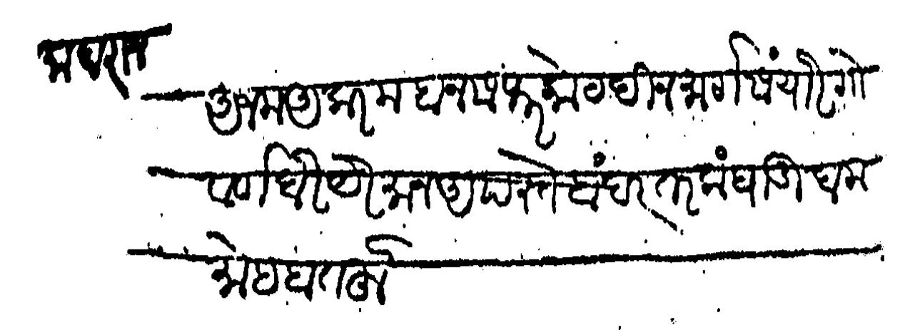

**Expert reading (93 chars):** माहाराज अजम अकरम बनसफर कोट दिनमार्ग संयोर गोवर्ण बेर येरमान आपस्ते बंदर तरकंबाडी दामा मोहबतहू

**Model output (99 chars):** माहाराज अजम अकरम बनसफर कोट दिन मार्गसीर्या रगोवर्ण घरे येमान आपले तेव्हां दर तर कंघाडी दम मोहबत हून

---

## MT-013 (source `1009.jpg`, CER 0.293)

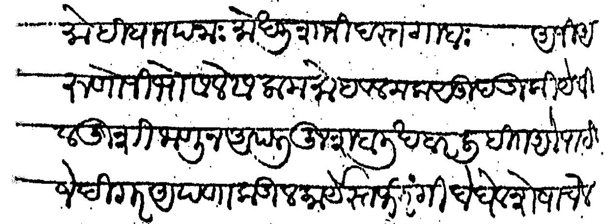

**Expert reading (167 chars):** मोहिबान पना मोखलीशानी दस्तगाहा अजी अरुणोजी भोसले सलाम मोहवल कमसुद आंकी येथील खुशी जाणून आपली खुशहाली खबर लिहीत अले पाहीजे दिगर आपणाकडील कार्येस्त फिरंगी दोघे व शेषाचेल

**Model output (178 chars):** मोहिबाल पना मोकळू शानीदर्सत गांधा अ४जी अरुणोजी भोसले २१ राममोहवल मला सुद तुकी येविल तुम्ही जाणून आपली तुम्हाबाली खबर लिहिता असे पाटीजे दिगर आपणाकडील कार्ये स्तरांती घेवें शेषाचेल

---

## MT-014 (source `101.jpg`, CER 0.131)

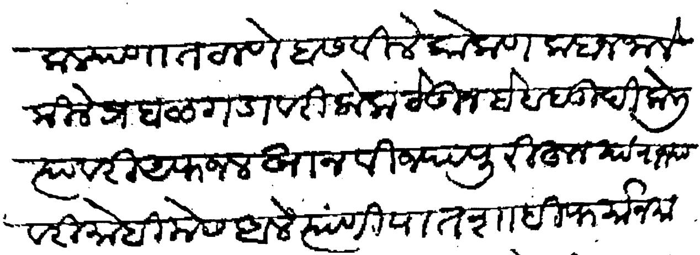

**Expert reading (153 chars):** कल्याणात ठाणे बसवीले कोकण कबज जाले किले प्रबळगडावरील लोक ठेऊन बेहबुदी केली त्यावरी अफजलखान विज्यापुरीहून यां राज्यावरी मोहिमेस आले त्यांणी पातशाही फर्मान

**Model output (158 chars):** कल्याणा तटाणे बसविले कोकण कबज जाले किले प्रबळगडावरी लोक ठेऊन है बुदीले केली त्यावरी अफजलखान विजयपुरीहून या राज्यावरी मोहिमेस आले त्यांणी पातशाही फर्मान मागाचा

---

## MT-015 (source `1010.jpg`, CER 0.129)

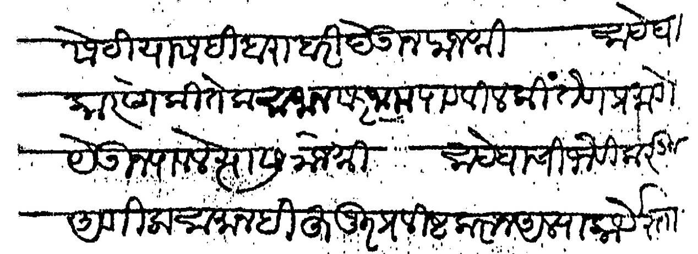

**Expert reading (178 chars):** सेटी यासही बराबरी देऊन राजश्री साहेबा कारणे कितेक सामान सरजाम पाठवीत की तेण प्रमाणे येऊन पावले त्यास राजश्री साहेबाची भेटी करऊन आणीक सामानही हुजुर प्रविष्ट करून आल्या कार्येस्तास

**Model output (179 chars):** सेटी यासहि बराबरी देऊन राजश्री साहेब कारणे कितेक सामान सरजाम पावविले किंतैन प्रमाणे येऊन पावले त्यास राजश्री कादेवाची भेटी करऊन आणिला सामानही हुजूर प्रविष्ट करून अल्या कार्ये रुपा

---

## MT-016 (source `1011.jpg`, CER 0.255)

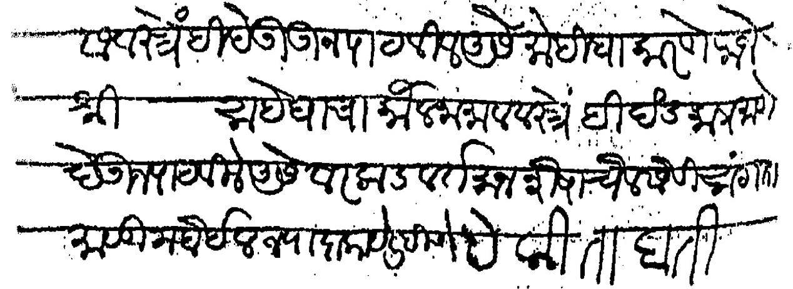

**Expert reading (196 chars):** कार्येस्तास वस्त्रे ही देऊऊन पाठवीले असे मोहिबा कारणे राजेश्री साहेबाचा कौलनामा व वस्त्रे ही दंडका प्रमाणे देऊन पाठवीले असे वरकड वर्तमान शेषाचेलसेटी सांगता माळीम होईल ज्यादा काये लिहीणे हे किताबती

**Model output (184 chars):** वास्तवें श्री हिदुरूफ पाटलील असे मोहिबा कारणे राजेश्री साहेबाचा कौल नाम वस्त्रें ही दंडकाप्रमाणे देऊन पाठविले असे वारकड वर्तमान शैश चौलसेविका गति माळीम दोयल न पादक येलिहीणे हे किताबाती

---

## MT-017 (source `1012.jpg`, CER 0.327)

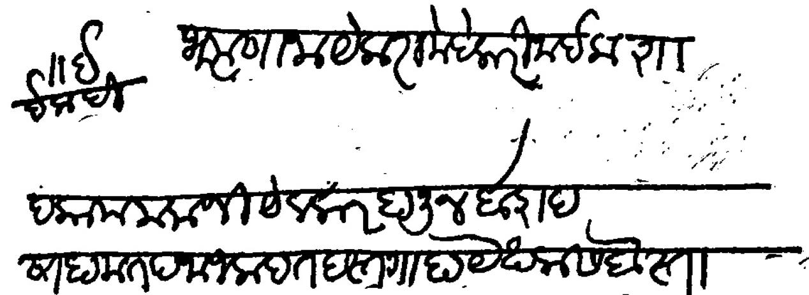

**Expert reading (104 chars):** इलाही भरमणा नायेकरा मेदकेरी नाईक शादकाम मलाजी येलकर हानूबाशद साहामत पनाहा जलादत दस्तगाहा येखलास बेस्ताणी

**Model output (95 chars):** राही भारतानायेकरामे देकरियाईक शाद काम मलाजी येलकर हालीन बांशदसा हामतपनाजवादतहस्तगाहा येखास होता

---

## MT-018 (source `1013.jpg`, CER 0.361)

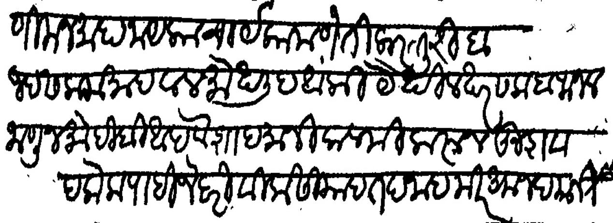

**Expert reading (180 chars):** बेस्ताणी मन्माहा नायेकाचार्य कामणेती कस्तुरी बाजद सलाम मोहवल मोखळीद आंकी येथील खैर सलाब फजल जाणून मोहीबी आपले शादमानी कलमी करून खुशवद केला पाहिजे दरीवीला सियादत पनाहा मीर अमजद यानी

**Model output (173 chars):** पाणी मनमाहा नायकाचा इकामणें तिकरतून बाजे सकलामादवल मोहली हा आंकी येथील खर सकबा पालनाणून मोहीमी आदेश शादमानी कान्ही करुन तुम्हावर केला पाहिजे दरीविला सियादत दमाद मिर अमलदामली

---

## MT-019 (source `1014.jpg`, CER 0.236)

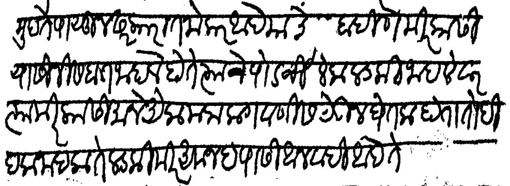

**Expert reading (203 chars):** मुदते पासून सरकारात नोकर आहे याचे बहण मीर कासी यासी निसबत जाहाले होते त्याचे पोटची येक लडकी जाहले वर त्या मीर कासीमाने येक मला लावगणीस ठेऊन घेतला होता तोही हक जाहला ते लडकी मीर अमजद पासी आन व्याही आहे ते

**Model output (202 chars):** मुदतेपासून खर करावा ते मोकर आहे याचे बादीगे मिरकासी यासी निसबत जाहाले होते त्याचे पोट ठाने लेकलडकी जाहले वार त्यामीर कासीनाने एक मजकूर वाणीस ठेऊन घेतला होता तोहि दक्षाधकत लडकीमीर अमजद पासी आलवादी आहे ते

---

## MT-020 (source `1015.jpg`, CER 0.256)

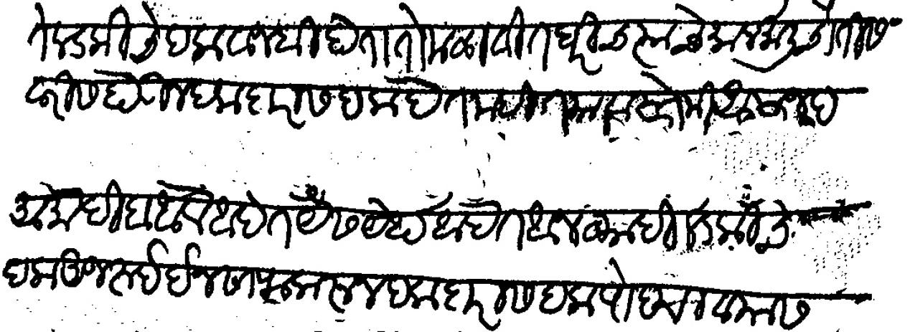

**Expert reading (199 chars):** लडकीचे हक वाजबी होता तो मळा वीत घरीच त्याचे माल माली चौतीस वारीस होऊन हक दारास हक देत नाहीत यावास्ते मीर अमजद आं मोहीबा आले आहेत यैस येथ आहेत आन व्याही लडकीचे हक अजरुई इनसाफ करून हकदारास हक पोहचावयास

**Model output (192 chars):** तेलडकीचे दकवाजबी होता तो मळावित घरीच त्याचे कलमार ठाणीस उरीस होऊन दकदारास हक होत नाही त्यावरून मिरासाजद आमादीबाबावे आहेत यैसे येथा आहेत आजल्याहि लाकीली दकडूजरुई इनसाफ करून दकदारास हक पोहचावयास

---

## MT-021 (source `1016.jpg`, CER 0.297)

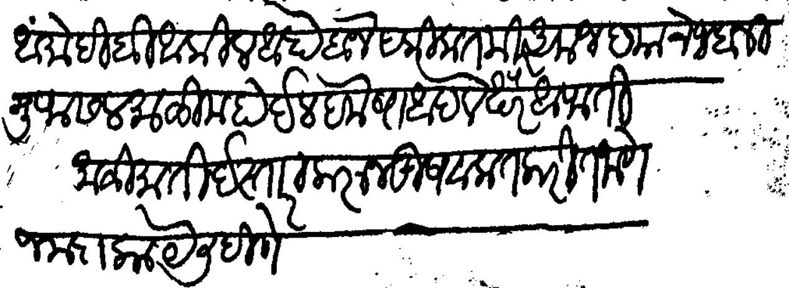

**Expert reading (148 chars):** आं मोहीबी आंकील आहेो बाजे हकिकत मीर अमजद याचे जबानी मुफस माळीम होईल हमेषा आपले खैर आफियेती माळीमाती ईस्तारा करून खुशवख्त करीत जाणे जयादा काये लिहीणे

**Model output (138 chars):** आंमोदीबी आलील आहे हाजे दकिकत मीर अमजद याने पेशवा नुफासल माळीम होईल हमेषा आहले खैरखाफती माळीमाती इस्तारी करन मुळाकत करीतील जमदाका येऊन हिगे

---

## MT-022 (source `1017.jpg`, CER 0.237)

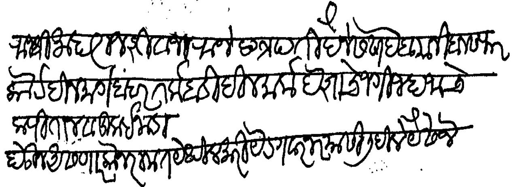

**Expert reading (190 chars):** राजश्री महाराज शिवाजीराजे छत्रपती हैनेस साहेब यानी बनसफर कोर्ट दिनमार्कबंदर तर्कबाडी दिनमार्क देशाचे जंगी जहाजाचे कपीतान व कुईनाडा होऊन असणार कोनरामत येथील मोरीयेर गववरनर यांसी लिहीले यैसेजे

**Model output (191 chars):** राजश्री महाराज शिवाजी राजे छत्रपती दौले सेवा ब्राम्हण सफर करोड़ हिनमार्ग बंदर तर्कबाडी हिनमार्ग देशाचे जगीज धांचे कपीतान व तुकईनाडा होऊन असणार कोनर नमत येथील मारियेस गवारनर मासीली हिले यैसेजे

---

## MT-023 (source `1018.jpg`, CER 0.305)

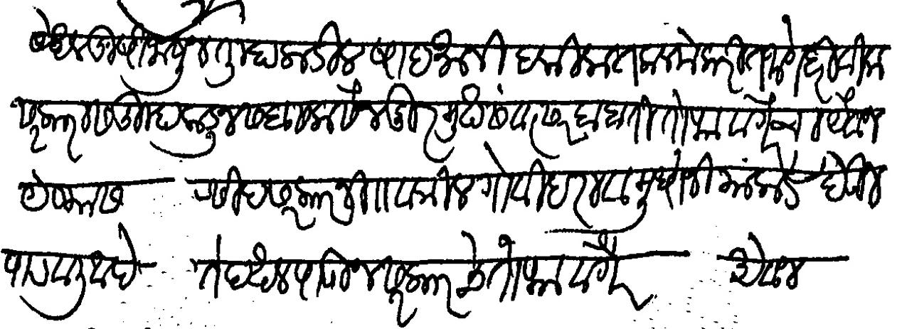

**Expert reading (233 chars):** येथील खुषी जानुन तुम्हाकडील षादमानी हकिकत कलमे करीत येणे दरीवीला सरकारास तुम्हाकडुन सबा सलासैन दुर्मुख संवत्सर बाबती तोफा वगैरेचा अैवज येण्यास रसीद सरकार नि वकील गोविंदराव मुधोजी यांकडे देऊन पाठवीली आहे ते दखल पाऊन सरकारचे तोफा वगैरे

**Model output (245 chars):** सेवेल दुष्टी जाणून तुम्हाकडील षादमानी दकिकात कलामे करीत रागे द्रविक सरकार रासदुर्घटाकडील सबा जकायेन दुरुस्त होण्यास बाबती तो फावगैरचा येण्यास येण्यास रसीद सरकार नि वाकील गोविदर नवा मुधोजी मांकडे देऊन पाठवावा आहे ते दखलपाडीन सरकारचे तो फावगैर अवज

---

## MT-024 (source `1019.jpg`, CER 0.346)

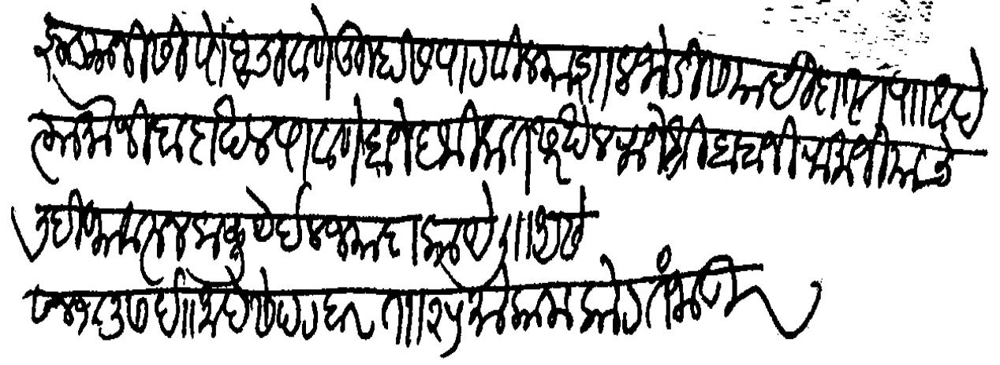

**Expert reading (234 chars):** अैवज झाड्यानीसी पोहचावणे तुम्हास पाठविल्या शाल जोडीस यादी दास्त पाठवीली आहे त्या बमोजिब दाखल पावणे बाजे हकिकत सरखेल राजश्री बाबाजी रामाजी याचे लिहीण्यावरून कळू येईल ज्यादा काय ली असे सन १८३७ ईसवी माहे सेपटबर तारिख २५ मोकाम कोट तंजावूर

**Model output (220 chars):** स्वकानीसी पोा अचलवणे तुम्हास पाठविल्या शाल जोडीस यादी दारुत पाा आहे त्या मौजीबादाखल पावणे बाजे बाजीकत खरखेल रुजे श्रीबाबाजी रामजी याचे लिहिणावयाप्रमुख येईल जमादाका येऊ असे सन १८७७ सदासिव देशपादर ताा श्रुमाले कोट तांजकडील

---

## MT-025 (source `102.jpg`, CER 0.130)

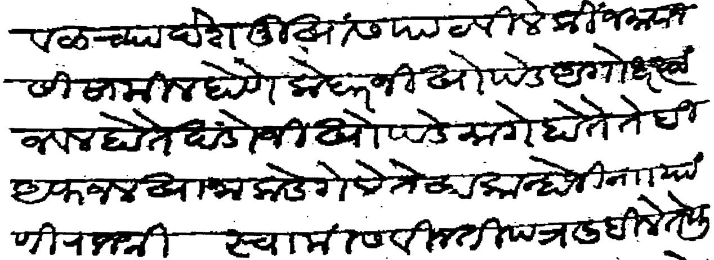

**Expert reading (200 chars):** मावळच्या देशमुखांस पाठविले की जमावानसी सामील होणे त्यास केदारजी खोपडे अगोधर त्या जवल होते खंडोजी खोपडे मागे होते ते ही अफजलखानाकडे गेले तेव्हा कान्होजी नाा याणी राजश्री स्वामीस विनती पत्र लिहिले तेथुन

**Model output (193 chars):** व लच्या देशमुखांस पाठविले कीं जमावासी सामील होणे केव्हारजी खोपडे अगोधर स्वाजवल होते खंडोजी खोपडे मागे होते ही अफजलखाना कडे गेलो तेव्हा कान्होजी नाा याणी राजश्री स्वामीस विनंती पत्र लिहिले तेथील

---

## MT-026 (source `1020.jpg`, CER 0.415)

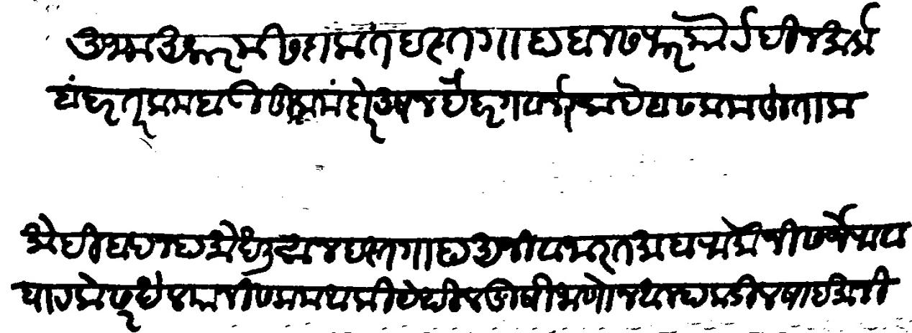

**Expert reading (234 chars):** अजम आकरम सदाकत दस्तगाहा दीनसफरा कोर्ट दिनमार्क बंदर तर्कबाडी कुमादोर तु अशन हैदरा गवरनरा साहेब सलाम उल हू ताला मोहबीन पनाहा मोखलीसान दस्तगाह अजी वजारत माहा रामोजी सरजेराव घाटके सरखेल यांनी सलाम आंकी येथील खुषी जाणुन तुम्हाकडील षादमानी

**Model output (224 chars):** अजाम अकरमी सदाकत हस्तगाहा बनसफर कोर्टही मार्क बंदर तरकम बाऊ तुम्हां दोश व नैबर गवाडर थायेब सकमहुताक मोहिबदन्हा मोखली आलहस्तगाहा अजीव जारत माहा फौजे निसर्ज फाव घारकोसर धेल्यानी सकम थाकीये थील तुम्ही जाणोन आम्हा कडील पाहिजे ती

---

## MT-027 (source `1021.jpg`, CER 0.209)

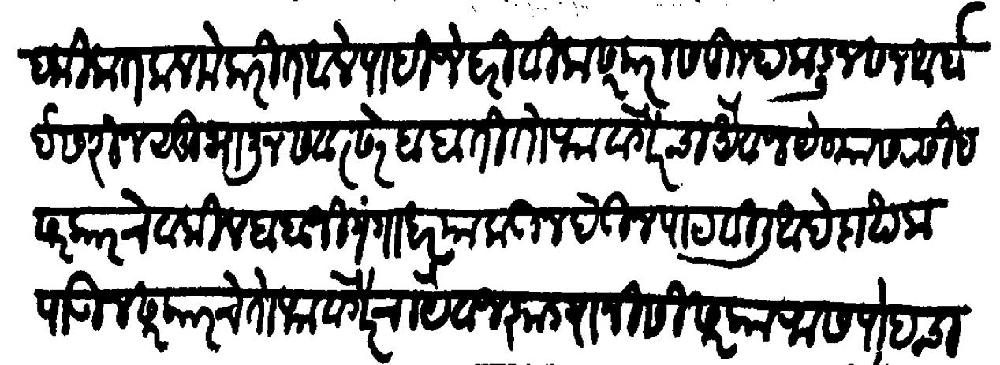

**Expert reading (235 chars):** हकिकत कलमे करीत आले पाहिजे दरीवीला सरकारास तुम्हाकडून सन आर्बा असरीन सुभानू संवत्सर बाबती तोफा वगैरेचा यैवज येण्यास रसिद सरकारचे वकील बाबाजी गंगाधर याकडे देऊन पाठविली आहे दाखला पाऊन सरकारचा तोफा वगैरेचा यैवज झाड्यानीसी सरकारास पोहचावणे

**Model output (235 chars):** दक्षिकात कलमे करीत आले पाहिजे दरीवीक सरकारास विद्यालयाचा निवार्य इसरीन सुभा मुनसवत सरेबाबाती तो फावगैरेचा ऐवज येण्यास रसीद सरकारचे व किलबाबाजीं गाघर याकडील देऊन पाठविली आहे दाखला पाऊन सरकारचे तोफावगैरेचा येवज झाड्यानीसी सरकारास पोहचावी

---

## MT-028 (source `1022.jpg`, CER 0.233)

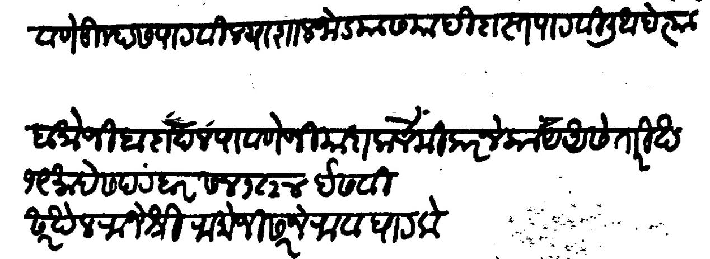

**Expert reading (180 chars):** पोहचावणे तुम्हास पाठविल्या शाल जोड्यास यादी दास्त पाठविली आहे त्या ब मोजिब दाखल पावणे ज्यादा कलमे करने काय असे तारिख १९ माहे शपटंबर सन १८२४ ईसवी सरखेल राजश्री रामोजी सर्जेराव घाटके

**Model output (181 chars):** वाणेकुल्हास पाटविल्या शाल भोडयास यादी दास्तपाटविली आहे त्या ब्राम्हणी बादांदैल पावणे जिमादाकलें मिकरने काय असे तरी ख १९ माहे सप्तरंबर सन १८२४ इसवी आरखेल राजश्री रामोजी सरजेराव घाटके

---

## MT-029 (source `1023.jpg`, CER 0.260)

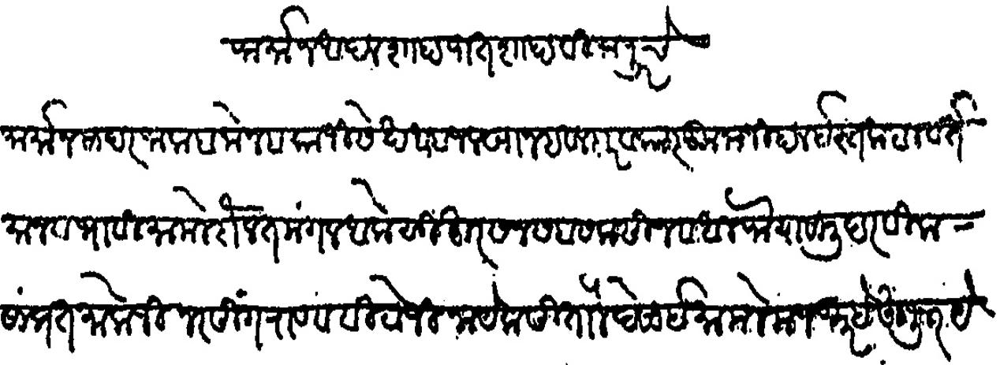

**Expert reading (262 chars):** फर्मान आदलशाहा पातशाहा विजापूरचे फर्मान सादर जाला ब मोजब काजी सेख अबजलखान हवालदार व कारकुनानी हाल इस्तकबील वर्तमान व भावी मामले दौलत मंगल आके सुहूर सन सबा सलासीन व अलफ या साली दरिवीला
सांप्रत मालोजी नरसिंगराज व विठोजी नायेक सितोले देसाई मामले मजकूर हे हुजूर येऊन

**Model output (243 chars):** फर्मान आदलशाहापातशाहाविस्तारीचे फर्मान सादर जाला बकेन बयानीसे खाहजलसान हसदार व कारकूनानीहान इस्तकटावत्ते मानवभावी मामले दौलतमंगल आकेसुंदार सन सबसकसीन सालफौजासी दारविला सांप्रत मालोजी परसिंगराव विठोजी नायेक सितारी देसई मामले मजकूर हे खुजर येथील

---

## MT-030 (source `1024.jpg`, CER 0.338)

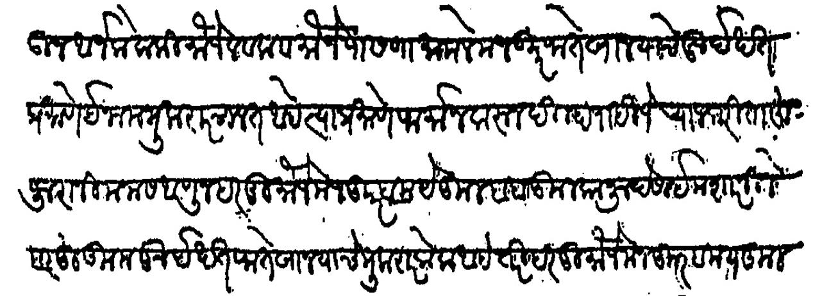

**Expert reading (296 chars):** येऊन अर्ज केला की मौजे लवला व मौजे पासणा मामले मजकूर फतेखान याचे खुर्द खत प्रमाणे ईनाम मुकरर चालत आहे त्याप्रमाणे फर्मान करून दिल्हा पाहिजे याजकरिता हुजुरांनी मनास आणून हर दू मौजे मजकूर बमये कुल बाब कूलकानू देसाई मशारनीले बर हुकुम खुर्द खत फतेखान याचे मुकरार केला आहे तरी हर दू मौजे मजकूर बमय कूल

**Model output (270 chars):** उन अर्ज केला की मौजे लेवलाव मौजे पोसणा मामले मजकूर फतेखान याचे लुट देखता प्रमाणे इनाम मुकारारचा नत आहे त्या प्रमाणे फर्मान करून दिल्हा नाहीजे चाला करीता ही फुरानी मनास आणून हर दुमाले मजकूर बाब येऊन बाब दुमाला करून देणे इमशारी गेला तुमाली देखत फतेखान याचे पुकारार केला आह

---

## MT-031 (source `1025.jpg`, CER 0.464)

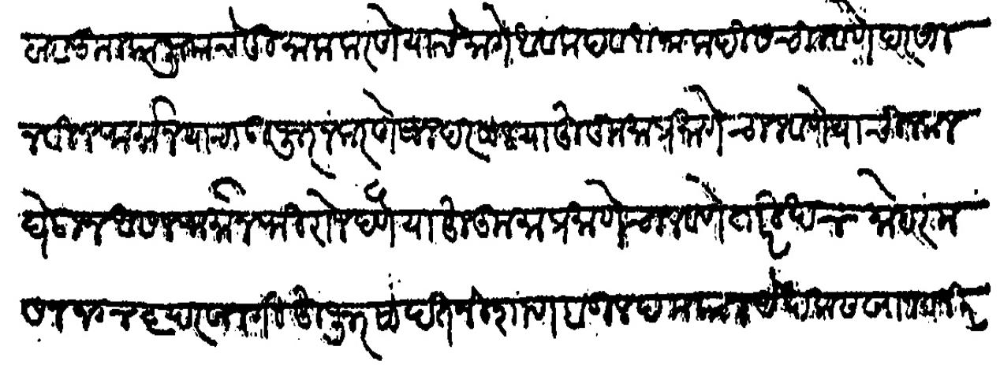

**Expert reading (274 chars):** बाब कूल कानू याचे दुमाला करणे याचे मागे अवलाद व अफलादीस चालवणे दर साल नवीन फर्मान याचा उजूर न करणे साल दर साल या हुकुमा प्रमाणे चालवणे याची नकल घेऊन असल फर्मान फिरोन देणे या हुकुमा प्रमाणे चालवणे तारिख ४ मोहरम सन १०४६ फसली परवानगी हुजूर सादत निशाण बुलंद मकान येखलास खान वजिर

**Model output (258 chars):** बाब उमा कुलावतंसें दिमाक करणे याचे मोगे आवकदवाडीनाकडीलची लावणे परसान विज्ञापना नयाचा उपूर्न करणे जालदरस्त याहून माझा गोचाल लावणे चालवणे याची जाल घेऊन असल फिरोज देणे याहून माझा गोचाल लावणे तारीख ४ माहे रजम सन १०४५ दरवार गीहू पूर्व हे दत्निशाण बुनलद मकान येथील

---

## MT-032 (source `1026.jpg`, CER 0.576)

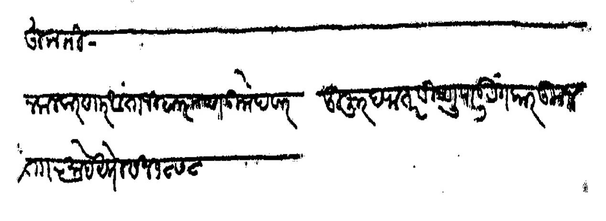

**Expert reading (99 chars):** हुकमी नकल करणार हुजुर दप्तर विष्णु पांडुरंग कारकून अंताजी बाळकृष्ण उमेदवार ता ५ माहे अप्रेल सन १८७८

**Model output (101 chars):** खुलामी नकल करणार आंतोजी बापूराव गोडबावर दुमुरदफतर विष्णु पांडुरंग कारकून ताा चत्रपट येथे अपेल सन १८७८

---

## MT-033 (source `1027.jpg`, CER 0.254)

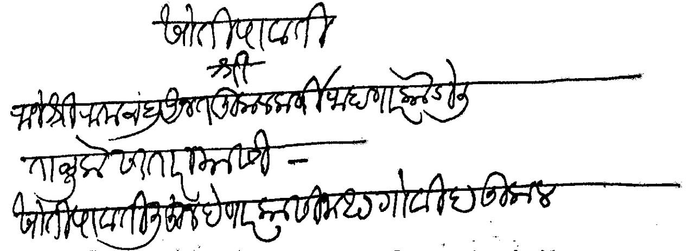

**Expert reading (118 chars):** श्री राजेश्री रामचंद्र अनंत कुलकर्णी राहाणार कोडोली तालुके सातारा यांसी खोती पावती लिहून देणार कासीनाथ गोविंद कुलकर्णी

**Model output (128 chars):** सोती पावती श्री राजेश्री रामचंद्र अनंत कुलकर्णी फहगार कौडे लिताली केसरी तारी मासी सोती पावती लिहून देणार कासीनाथ गोविंद कुलकर्णी

---

## MT-034 (source `1028.jpg`, CER 0.387)

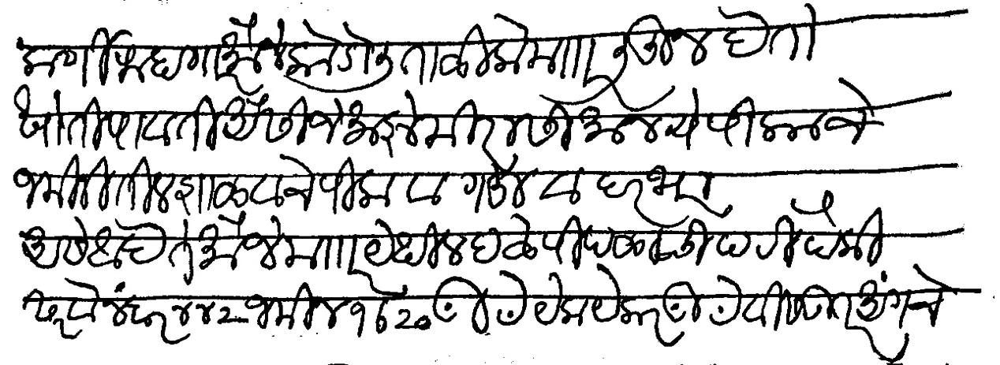

**Expert reading (243 chars):** कुलकर्णी राहाणार मौजे कोडीली ताळुके मजकूर लिहून देतो खोती पावती अैसाजे माझे मिरासी मान्ये पीकाचे जमिनीतील शाळवाचे पीक व गहु व हरभरा असे आहे ते मौजे मजकूर येथील दळे पिंपळाची पटी पैकी सर्वे नं ४४२ जमीन १ आळं २० गुंठे येक येकर वीस गुंठे उतर अंगचे

**Model output (222 chars):** कागिज आहा गजानेल कोडली ताळी केला तर लिहून देतो खोती पावती असीजे शनेमीरासी जालेये पिलाजे जमीनी ती लश्चाळवाचे पिलावा गडलेवा दरभार असे आहे ते मौजे माा येथील दळेविपसोडी पटी पैकी सर्वानंद वारन २ जमीन १६२० टे येक येकर उटार अंगचे

---

## MT-035 (source `1029.jpg`, CER 0.416)

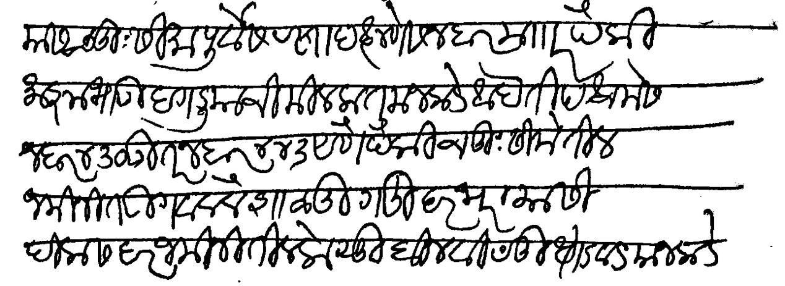

**Expert reading (219 chars):** यास चतुसीमा पूर्वेस रस्ता दक्षणेस नंबर मजकूर पैकी माझा भाऊ दगडू याची मिलकत मजकडे आहे ती पश्चमेस नंबर ४३० उतर नंबर ४४३ येणे पैकी चतुसीमेतील जमीनीत उगवलेले शाळू गहू व हरभरा यास पीक सदर जमीनीतील केसू बीन विदू धोंडवड याजकडे

**Model output (220 chars):** यासी लिहून मापुर्वेस रस्ता दक्षणेस नदार सार पैकी खत्नम भाऊ बागडीयाची मिळल कतमजलकडे आहेती पेशवेस नदार नू ३ उतन दार नू ३ अणेपैकी चांगली तील जमिनीत उगवले शाळाची गड दार भरत्यासी दिकास दार जमिनीतील लोसीत बिनवारेसी खोडवड मजकडे

---

## MT-036 (source `103.jpg`, CER 0.149)

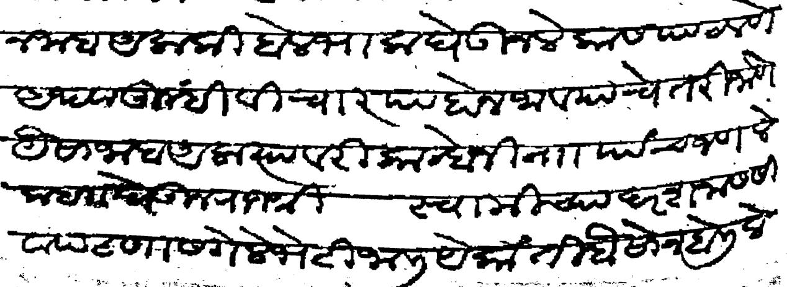

**Expert reading (201 chars):** जाब आला की बेलभाक घेऊन लेकास पाठवणे अथवा तुम्ही विचार पाहोन जावयाचे तरी जाणे यैसा जाब आला त्यावरी कान्होजी नाा पाचजण लेक बाा घेऊन राजश्री स्वामीच्या दरशनास सीवापटणास गेले भेटी जाली येकांती बैसोन बोलिले

**Model output (195 chars):** न जाबसला की बेलभाक घेऊन ले कासपाटलणे अथवा तुम्ही विचार पाहोन जावयाचे तरी जाणे ऐसा जाबसला त्यावरी काम होनी नाहीच जणले कहला घेऊन राजश्री स्वामीच्या दर शनसीवापटणास गेले भेटी जाली येकांतीबैसोन बोलिले

---

## MT-037 (source `1030.jpg`, CER 0.284)

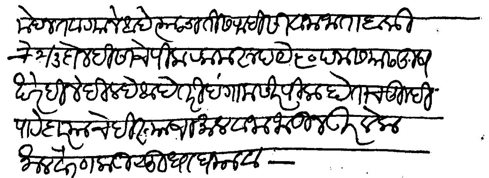

**Expert reading (218 chars):** मेहेनत वाटयाने आहे त्याचा तिसरा हिसा वजा जाता बाकीचे २ ३ दोन हिसाचे पीक रक्कम रुपये ५० पनास यास खुष खरेदीने दिल्हे आहे तरी हंगामसीर पीक होताच तुम्ही पाटेदार याचे हिस्याचा माल वजा जाऊन उरलेला माल वैरण काडी सुध्धा घ्यावा

**Model output (210 chars):** मेहनत वाटयाने आहे त्याचा तीस आदिसी वजा जाता बाकीचे श्रुत होन दिसाचे पिकरक मरन पये ५० पनास यास खुषखर हिले दिल्हे लादेतरी दंगाम सरविला होता चतुर्दिपारे दारमलचे दिस्त्याजामल वजा जाऊन उरलेला मालवरण कडीसी ध्याघ्यावा

---

## MT-038 (source `1031.jpg`, CER 0.912)

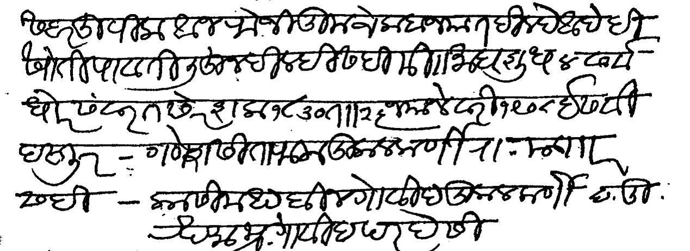

**Expert reading (240 chars):** सदरहू पीक आज रोजी तुमचे कबज्यात दिल्हे आहे ही खोती पावती लिहून दिल्ही सही मिती माघ शुध ४ संवत्सरे शक १८३० ताा २५ ज्यानेवारी १९०८ ईसवी दस्तूर गणेश सीताराम कुलकर्णी रा मजकूर सही कासीनाथ बीन गोविंद कुलकर्णी दस्तुर खुद रखमा भ्रतार गोविंद परदेसी

**Model output (256 chars):** अखंडित लक्ष्मी आलंकृत राजमान्य श्र्नोा विज्ञापना विज्ञापना विज्ञापना विज्ञापना विज्ञापना विज्ञापना विज्ञापना विज्ञापना विज्ञापना विज्ञापना विज्ञापना विज्ञापना विज्ञापना विज्ञापना विज्ञापना विज्ञापना विज्ञापना विज्ञापना विज्ञापना विज्ञापना विज्ञापना विज्ञाप

---

## MT-039 (source `1032.jpg`, CER 0.272)

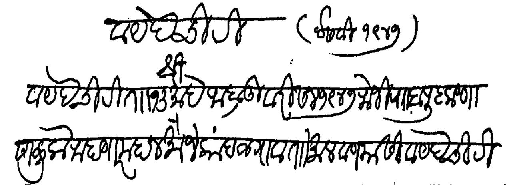

**Expert reading (125 chars):** श्री वायदे चिठी ताा १३ माहे फेब्रुवारी सन १९४७ रोजी रा बापू कृष्णा सालुके राहाणार महान मौजे कांदळगाव ताो मालवण यासी वायदेचिठी

**Model output (133 chars):** व येदेखीरी १९४७ व येदेखीरी ता १३ माहे फबुजुवारी सन १९४७ रोजी पाा बापू कृष्णा सालूक राहणार महान मौजे कांदळगाव ता मालवण यासी व येदेखीरी

---

## MT-040 (source `1033.jpg`, CER 0.433)

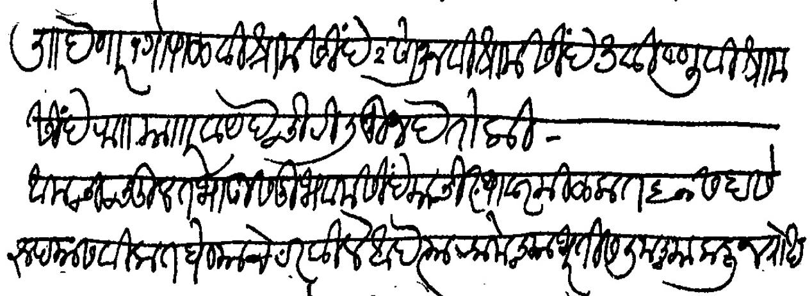

**Expert reading (238 chars):** लिहून देणार १ गोपाळ विश्राम शिंदे २ सोनू विश्राम शिंदे ३ विष्णु विश्राम शिंदे रा मजकूर वायदे चिठी लिहून देतो की आमचा चुलत भाऊ सदू भवाना सिंदे याची स्थावर मिळकत ६०० सहाशे रुपयास विकत घेण्याचे ठरविले आहे त्या रकमेच्या भरतीस तुमच्या कडून रोख

**Model output (240 chars):** लिा होणार १ गोष्ट सळ विश्रीमंडळीं दें २ साज्ञविश्रामींडीं देचवडीपणू विश्रामींडीं देफता मजकूर व येदो चिटी लिहून देतो कली आमचा ठाणूल तथाउस दुभावमंडळीं देकळी श्षादर मिळकत ६० सबसे रुपयास विकत घेऊनचे ठरवीले आदेश रकमेच्या अर्थीस लिहृताकरून तो असल

---

## MT-041 (source `1034.jpg`, CER 0.283)

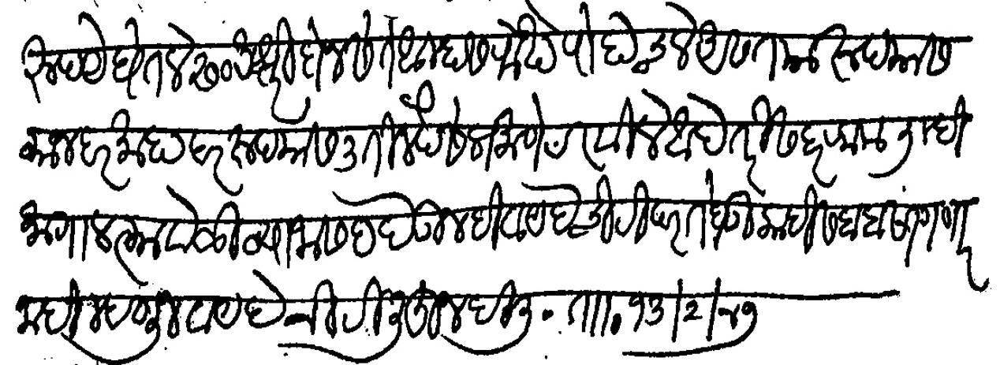

**Expert reading (258 chars):** रुपये घेतले २०० अक्षरी रुपये दोनशे ते आम्हास रोख पोचले असेत या रुपयास व्याज दर माहा दर रुपयास ३ तीन पैसे प्रमाणे ठरविले आहे तरी सदर रक्कम तुम्ही मागाल त्यावेळी व्याजासह देऊन ही वायदे चिठी परत घेऊ काही सबब सांगणार नाही म्हणून वायदे चिठी लिहून दिली ताा १३/२/४७

**Model output (246 chars):** सुपये घेतले २०० अक्षरी बोनसते आम्हास फिर्यावा होऊ लें असत माझ्यास याजबर माहादजकड्यास सातील दैवसलामणे चार विलेखे तरी सदरफाल तुम्ही माणाल त्यावेळी ठ्याजास हे देऊन ही वायदे चिटी घरात घेऊ काही सबब सांगणार नाही म्हणून वायदे चिटी लिहून दिली ता १३ ०२ ४७

---

## MT-042 (source `1035.jpg`, CER 0.044)

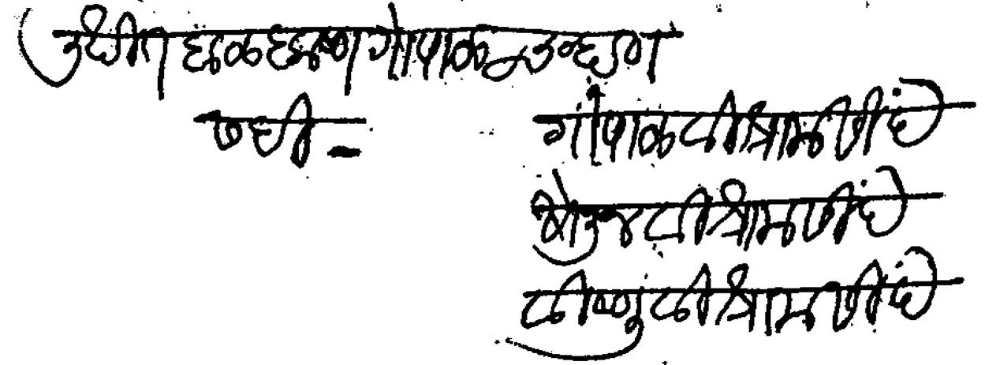

**Expert reading (91 chars):** लिखीत बाळकृष्ण गोपाळ चव्हाण सही गोपाळ विश्राम सिंदे सोनू विश्राम सिंदे विष्णु विश्राम सिंदे

**Model output (92 chars):** लेखीत बाळकृष्ण गोपाळ चव्हाण सही गोपाळ विश्राम सिंदे भोजून विश्राम सिंदे विष्णु विश्राम सिंदे

---

## MT-043 (source `1036.jpg`, CER 0.129)

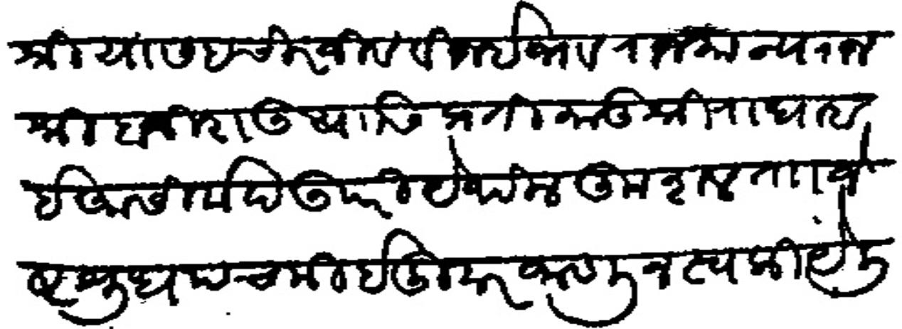

**Expert reading (155 chars):** श्रीया सह चिरंजीव विजीभव राजमान्य राजश्री बाजीराऊ यांसी प्रती मातुश्री राधाबाई आसीर्वाद उपरी येथील कुशल ताा ज्येष्ठ शुध्द पंचमी इंदुवार जाणोन स्वकीये लेहीत

**Model output (144 chars):** श्रीया सहचिरजीव विजीभव राजमान्य राजश्री बाजीराऊ यांसी प्रति मातुश्री राधाबाई आसीर्वाद उपरि येथील कुशल ताा जेष्ट शुध पंचमी इदुरफासून स्वकीये लग्न

---

## MT-044 (source `1037.jpg`, CER 0.073)

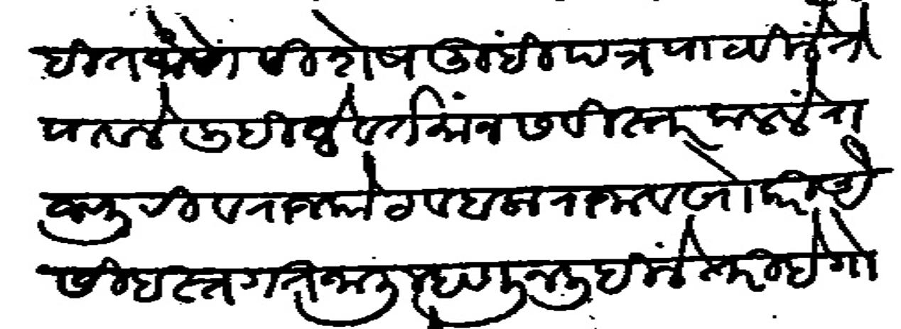

**Expert reading (151 chars):** लेहीत जाणे विशेष तुम्ही पत्र पाठवीले ते पावले लिहीले वर्तमान सविस्तर कळले राजपुरी व राजकोट व बलाराजा व खोकरी ऐशी हस्तगत जाली म्हणून लिहीले तरी हे गोष्ट

**Model output (149 chars):** ही तफरंग विशेष तुम्ही पत्र पाठविले ते पावले लिहीले वर्तमान सविस्तर कळले राजपुरी व राजकोट व बलाराजा व खोकरी ऐसी हस्तगत जाली म्हणून लिहिले तरी हे गोष्ट

---

## MT-045 (source `1038.jpg`, CER 0.345)

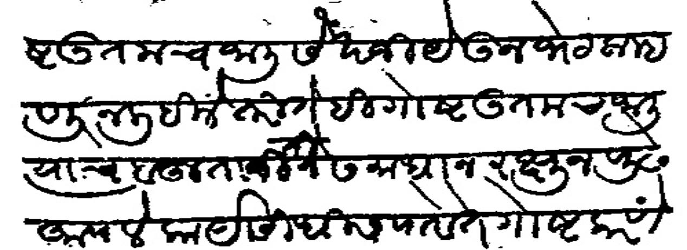

**Expert reading (145 chars):** गोष्ट उतमच जाली सेखजी येऊन भेटला म्हणून लिहीले तरी ते गोष्ट उतमच जाली त्यांचे बहुता रीतीने समाधान रथून पुढे आपले कार्य सिध्दीस पावे ते गोष्ट करणे

**Model output (150 chars):** प्रत्येक उतमच जाली संख्येतून भेटला म्हणून लिहिले तरी तही गोष्ट उतमच जाली याच बहुत काये लिहिणे समाधान रक्षावयापूर्वक आपले कार्यासी दिसणार ते गोष्ट करणे

---

## MT-046 (source `1039.jpg`, CER 0.093)

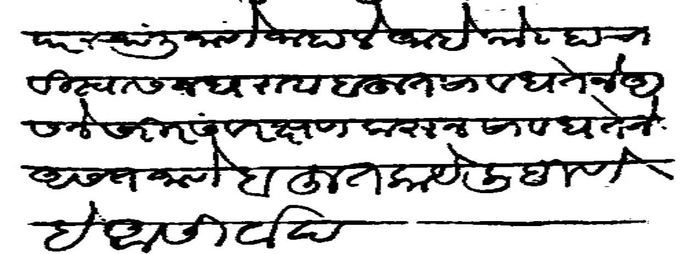

**Expert reading (129 chars):** परस्थळी जाणे जाले आहे कोण्हाचा विश्वास न धरावा बहुत सावधतेने असणे शरीर संरक्षण करून सावधतेने असत जाणे बहुत काय लिहीणे हे आसीर्वाद

**Model output (132 chars):** परस्परे जाणे जाहाले आहे कोण्हाचा विश्वास न धरावा बहुत सावधतेने असने सरीरसंवरक्षण करून सावधतेने असत जाणे बहुत काये लिहिणे हे आसिर्वाद

---

## MT-047 (source `104.jpg`, CER 0.170)

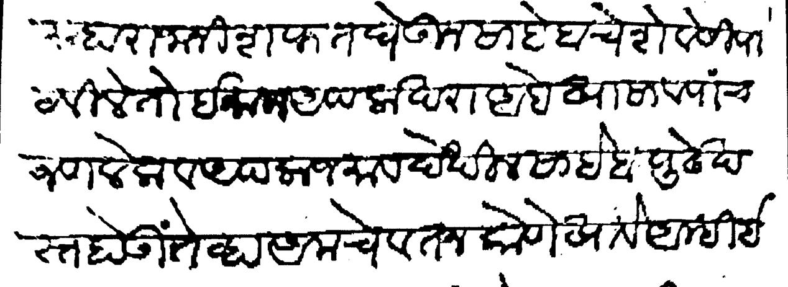

**Expert reading (153 chars):** माहाराजानी शफत घेऊन साहेबाचे शेवेसी पाठविले तो ईमान आपला खरा आहे खासा व पांचजण लेक व अपला जमाव देखील साहेबापुढे खस्त होऊं तेव्हा आमचे वतन कोणे खावे आम्ही

**Model output (154 chars):** राहारा नाजी शफत घेऊन साहेबाचे शेवेसी पाठविले तो इमाम अवलाखरा आहे आपणापांच जणलेक व अपलाज मावदेखील साहेब पुढे खस्त होऊं तेव्हा आमचे वतन कोणे खावे आम्ही इतकी

---

## MT-048 (source `1040.jpg`, CER 0.026)

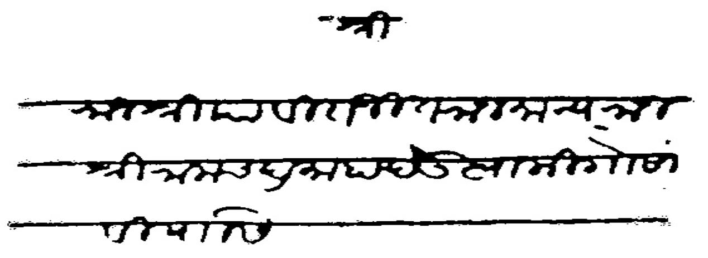

**Expert reading (76 chars):** श्री राजश्रीया विराजीत राजमान्य राजश्री रामचंद्र माहादेऊ स्वामी गोसावी यांसी

**Model output (76 chars):** श्री राजश्रिया विराजित राजमान्य राजश्री रामचंद्र माहादेऊ स्वामी गोसावी यांसी

---

## MT-049 (source `1041.jpg`, CER 0.335)

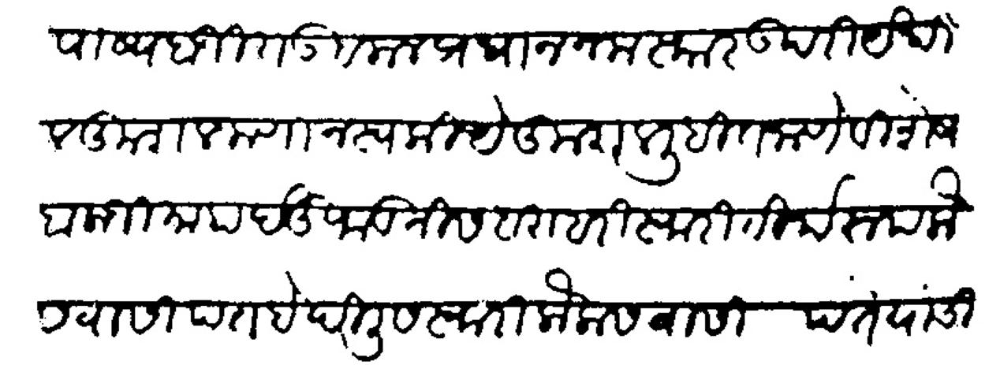

**Expert reading (179 chars):** पोष्य बाजीराव बलाल प्रधान नमस्कार उपरी येथील कुशल जाणोन स्वकीये कुशल लिहीत जाणे विशेष बालाजी माहादेऊ फडणीस बराबरी स्वारी तीर्थरूप कैलासवासी पंत हे दिलीस स्वारी कैलासवासी पंत यांची

**Model output (178 chars):** पाष्ठ होत तुमचा प्रकान जमस्कर उपरि येथील कुशल जाणार नस्य किंचे दुमगा लाहीत जाणे विशेष बामगीयापंडी फडनीस बराबरी स्वारी तीर्यरूप मौजे रवासी पत्र हे पिली स्वारी लौकर रवासी पंत यांसी

---

## MT-050 (source `1042.jpg`, CER 0.434)

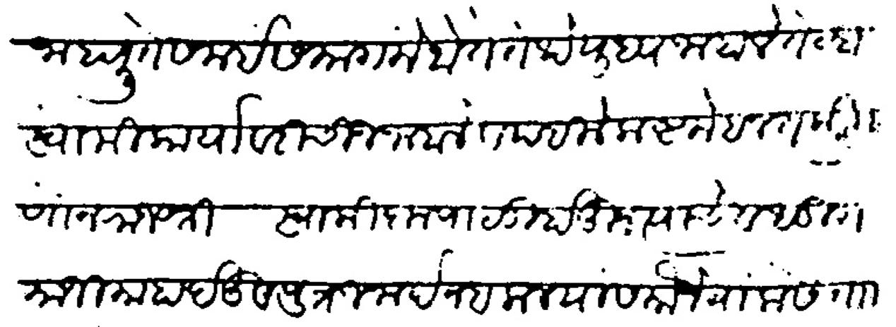

**Expert reading (205 chars):** जाहली ते समई समागमे होते तेथे युध्द जाहाले तेव्हा स्वामी कार्यावारी चीज जाहाले व पहीले कष्ट मेहनत केली म्हणोन राजश्री स्वामी कृपाळी होऊन त्यांचे बंधू रामाजी माहादेऊ व पुत्र जनार्दन बलाल यास मौजे वालोसे ताा

**Model output (191 chars):** न बापूते समई समागमें होते तेथे पुर्वाज बालें तें दास्त्यामी कार्यावरी चिडनाहालें आपहले कस्तोब न तर्फी आणांन राजश्री स्वामीदाम पाठऊन दुसर्याचे व अडीगमाजी माहादेऊ पुत्र जमादीनहक नयांस फौजा कसता

---
